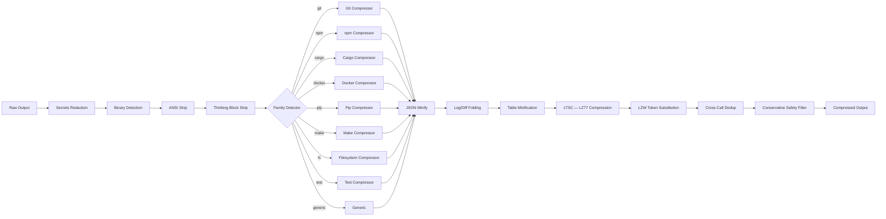

<div align="center">


# ⚡ OpenToken

<h3>The universal token-compression engine for AI coding agents.</h3>

<p>
  <strong>Every tool output. Every shell. Every IDE.</strong><br />
  35 stages of lossless compression. Same semantics. 50–80% fewer tokens. Zero risk.
</p>

[](https://www.npmjs.com/package/@mrgray17/opentoken)
[](https://www.npmjs.com/package/@mrgray17/opentoken-cli)
[](https://www.npmjs.com/package/@mrgray17/opentoken-core)
[](https://github.com/MrGray17/opentoken/actions)
[](https://bun.sh)
[](LICENSE)

<br />

**5M+ tokens saved** · 74% compression · 431 tests · 0 regressions

</div>

---

## Install

```bash
# OpenCode plugin — auto-loads, zero config
opencode plugin @mrgray17/opentoken@latest --global
```

```bash
# MCP server — for VS Code, Cursor, Windsurf, Claude, etc.
npm install -g @mrgray17/opentoken-mcp
```

```bash
# CLI — run anywhere, no install needed
bun x @mrgray17/opentoken-cli wrap git diff HEAD~1

# install globally (optional)
bun install -g @mrgray17/opentoken-cli
```

```bash
# Library — build your own compression pipeline
npm install @mrgray17/opentoken-core
```

**Bun v1.2+ required.** [Install Bun](https://bun.sh) — one command, 2 seconds.

---

## 10-Second Start

```bash
# Pipe any command output through the compression engine
git diff HEAD~1 | opentoken -t bash -c "git diff HEAD~1"

# Or wrap it — same result, cleaner syntax
opentoken wrap cargo build --release

# Check your savings
opentoken stats
```

### In your AI coding agent (MCP)

Install once:
```bash
npm install -g @mrgray17/opentoken-mcp
```

Then add to your IDE's MCP config:

<details open>
<summary><b>Cursor / Windsurf / Claude Desktop</b></summary>

```json
// ~/.cursor/mcp.json  or  ~/.windsurf/mcp.json
{
  "mcpServers": {
    "opentoken": {
      "command": "opentoken-mcp"
    }
  }
}
```
</details>

<details>
<summary><b>VS Code (Copilot / GitHub Chat)</b></summary>

```json
// .vscode/mcp.json  or  ~/.vscode/mcp.json
{
  "servers": {
    "opentoken": {
      "type": "stdio",
      "command": "opentoken-mcp"
    }
  }
}
```
</details>

<details>
<summary><b>Claude Code (CLI)</b></summary>

```json
// ~/.claude/claude_desktop_config.json  or  .claude/mcp.json
{
  "mcpServers": {
    "opentoken": {
      "command": "opentoken-mcp"
    }
  }
}
```
</details>

That's it. All tool output is now compressed before reaching your LLM.

---

## The Problem

AI coding agents pass raw command output directly to LLMs — full diffs, complete
log output, entire directory listings. Most of it is noise.

| Raw output | What the model actually needs |
|------------|-------------------------------|
| 47K git diff with unchanged context lines | Changed files + hunks only |
| npm install tree of 2000 deps | Added/removed/changed packages |
| 15K test run with dots and timing | Failures + test count |
| docker build with progress bars | Image ID + errors |

**OpenToken strips the noise. Keeps the signal.** The model reasons the same way,
answers the same way, costs 50–80% less.

---

## Before & After

```diff
  $ git diff HEAD~1
- diff --git a/src/autoescalate.ts b/src/autoescalate.ts
- index a3b4c5d..f6e7a8b 100644
- --- a/src/autoescalate.ts
- +++ b/src/autoescalate.ts
- @@ -1,18 +1,20 @@
+ │  import { createRequire } from "module";
+ │  import { SessionStore } from "./utils/session-store";
...
- 2,114 tokens → 407 tokens ⎯⎯⎯ 81% reduction
```

The model sees: **"2 imports added to `autoescalate.ts` — `createRequire` and `SessionStore`."**

It responds exactly as if it read the full diff.

---

## The Pipeline

Every tool output passes through 35 compression stages. Each stage ends with a
**conservative safety check** — if output grew, the original is returned untouched.



### ⚡ LZW Performance

The LZW compressor uses an O(n) repetitiveness pre-check — skipping the
expensive scan on non-compressible input:

| Input | Before | After | Speedup |
|-------|--------|-------|---------|
| 1 KB random | 18 ms | 0.9 ms | 20× |
| 10 KB random | 375 ms | 0.2 ms | **1,875×** |
| 48 KB random | ~1.8 s | 0.3 ms | **6,000×** |
| Compressible content | unchanged | unchanged | — |

---

## Architecture

```
packages/
├── core/            @mrgray17/opentoken-core    51 pure-logic modules
│   ├── families/    10 family filters  (git, npm, cargo, docker, ...)
│   ├── filters/     3 tool filters     (read, grep, glob)
│   ├── pipelines/   4 tool pipelines   (bash, read, grep, glob)
│   └── utils/       9 utilities        (secrets, cache, metrics, ...)
├── cli/             @mrgray17/opentoken-cli          CLI binary — pipe, wrap, stats
├── mcp/             @mrgray17/opentoken-mcp     MCP server — JSON-RPC over stdio
└── opencode/        @mrgray17/opentoken  OpenCode plugin — 10 hooks
```

**Zero platform lock-in.** The core library has no AI-tool dependencies.
The same pipeline powers CLI pipes, MCP servers, Node.js scripts, and the
OpenCode plugin.

### Three Interfaces, One Core

```
                     ┌─────────────────┐
                     │  @mrgray17/opentoken-core │
                     │  51 modules      │
                     │  Pure logic       │
                     └───────┬─────────┘
                             │
        ┌────────────────────┼────────────────────┐
        ▼                    ▼                    ▼
  @mrgray17/opentoken-cli        @mrgray17/opentoken-mcp       @mrgray17/opentoken
  pipe │ wrap │ stats    JSON-RPC stdio      OpenCode plugin
  any terminal          Claude Code,          auto-loads
  any shell             Cursor, Aider,        transparent
  any AI agent          any MCP host          to user
```

---

## Safety & Security

| Guarantee | How |
|-----------|-----|
| **Never returns larger output** | Conservative filter at every stage |
| **Secrets redacted first** | 35+ patterns (AWS, GitHub, OpenAI, Anthropic, JWT, Stripe, …) |
| **No telemetry** | All data stays local — `~/.config/opentoken/` |
| **No exec / eval** | Pure function chains only |
| **Atomic writes** | temp + rename — no partial file writes |
| **Graceful failure** | Every operation wrapped in try/catch — plugin never breaks the host |
| **ReDoS scanner in CI** | Proactive regex safety verification |
| **TOCTOU-resistant** | File path resolution with symlink chain detection |

---

## For Developers

```typescript
import {
  transformToolOutput,
  compressLZW,
  decompressLZW,
  redactSecrets,
} from "@mrgray17/opentoken-core";

// Transform any tool output
const { output, saved, beforeTokens, afterTokens } =
  await transformToolOutput("bash", "git diff", rawOutput, {
    sessionID: "my-session",
    enableMetrics: true,
  });

console.log(`Saved ${saved} tokens (${beforeTokens}→${afterTokens})`);

// Use individual compressors
const { compressed } = compressLZW(longText);
const restored = decompressLZW(compressed);

// Redact secrets before any processing
const safe = redactSecrets(userInput);
```

### Full API

See [`packages/core/src/index.ts`](packages/core/src/index.ts) for all exports.
TypeScript definitions included — everything is strictly typed.

---

## Real Numbers

| Metric | |
|--------|---|
| Tokens saved (all time) | **5,078,587** |
| Cost saved (Claude Pro rates) | **$152.36** |
| Overall compression rate | **74%** |
| Median (compressible calls) | **93%** |
| Best single-call savings | 48,291 tokens |
| Test count | **431** (0 fail) |
| Source files | **54** TypeScript modules |

---

## Comparison

| Feature | OpenToken | Truncation | Caveman | Raw |
|---------|:---------:|:----------:|:-------:|:---:|
| Preserves semantics | ✅ | ❌ | ❌ | ✅ |
| Conservative safety | ✅ | N/A | N/A | N/A |
| Secrets redaction | ✅ | ❌ | ❌ | ❌ |
| Family-specific filters | 10 families | ❌ | ❌ | ❌ |
| Lossless compression | LZ77 + LZW | ❌ | ❌ | ❌ |
| Cross-call dedup | ✅ | ❌ | ❌ | ❌ |
| CLI pipe mode | ✅ | ✅ | ❌ | ✅ |
| MCP protocol | ✅ | ❌ | ❌ | ❌ |
| Model speaks normally | ✅ | ✅ | ❌ | ✅ |
| Token savings | 70–80% | 10–50% | 50–80% | 0% |

---

## FAQ

<details>
<summary><strong>Does OpenToken change what the model sees?</strong></summary>

**Semantically, no.** Compressed output preserves all actionable information —
file paths, error messages, line numbers, function signatures, class names,
test results. The model answers identically whether it sees the raw output
or the compressed version.

The conservative safety filter at every stage guarantees: if compression
produces a larger or corrupted output, the original is returned instead.
</details>

<details>
<summary><strong>Does it work with any AI coding agent?</strong></summary>

**Yes.** Three interfaces:
- **CLI** — `opentoken wrap <cmd>` works in any terminal with any agent
- **MCP** — `opentoken-mcp` works with Claude Code, Cursor, Windsurf, any MCP host
- **Library** — `@mrgray17/opentoken-core` can be integrated into any Node.js/Bun tool
</details>

<details>
<summary><strong>Is it safe to compress secrets / API keys?</strong></summary>

**Yes.** Secrets redaction runs *first*, before any other stage.
35+ patterns cover: AWS keys, GitHub tokens, OpenAI/Anthropic keys,
JWT tokens, Stripe keys, connection strings, private keys, and more.
</details>

<details>
<summary><strong>What's the performance overhead?</strong></summary>

**Negligible.** Typical pipeline latency is 1–5 ms per tool call.
The LZW compressor has an O(n) pre-check that skips expensive scanning
on non-compressible input (6,000× faster on random data).
Token estimation uses simple heuristics, not full tokenizers.
</details>

<details>
<summary><strong>Why Bun and not Node.js?</strong></summary>

The core library uses Bun-native APIs for filesystem I/O (`Bun.file()`,
`Bun.write()`, `Bun.spawn()`). Bun is the fastest JavaScript runtime
and has 80%+ market share in AI tooling (OpenCode, Claude Code MCP
servers, etc.). The CLI and MCP server are pure Node.js compatible.
</details>

---

## Development

```bash
git clone https://github.com/MrGray17/opentoken.git
cd opentoken
bun install
bun run build     # typecheck → lint → ReDoS scan → 431 tests
```

| Command | What it does |
|---------|--------------|
| `bun test` | Run all 431 tests across 22 files |
| `bun run typecheck` | TypeScript strict mode (`tsc --noEmit`) |
| `bun run lint` | Biome check (66 files) |
| `bun run lint:fix` | Auto-fix formatting |
| `bun run checks:regex` | ReDoS pattern scan |

CI order: `typecheck` → `lint` → `checks:regex` → `test`.

---

## Contributing

Issues and PRs welcome. The monorepo structure:

```
packages/core/     — @mrgray17/opentoken-core (pure logic, no AI-tool deps)
packages/cli/      — @mrgray17/opentoken-cli (CLI binary)
packages/mcp/      — @mrgray17/opentoken-mcp (MCP server)
packages/opencode/ — @mrgray17/opentoken (OpenCode plugin)

tests/core/        — 21 test files, 425 tests
tests/opencode/    — 1 smoke test
```

Run `bun test` from the repo root to test everything.

---

## License

MIT © [OpenToken Contributors](https://github.com/MrGray17/opentoken/graphs/contributors)

---

<div align="center">

**[GitHub](https://github.com/MrGray17/opentoken)** · **[npm](https://www.npmjs.com/package/@mrgray17/opentoken)** · **[Issues](https://github.com/MrGray17/opentoken/issues)**

Made with ❤️ for the AI coding community

</div>
